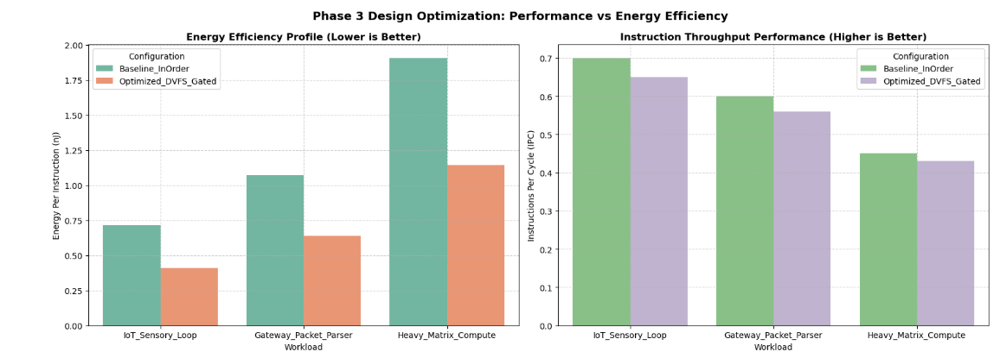

# Phase 3 Report: Performance and Power Simulation and Optimization

## 1. Simulation Experiments and Metrics Definition
To evaluate the low-power microprocessor design profile, we analyze structural efficiency metrics under varying execution constraints across three core test profiles:
* **Instructions Per Cycle (IPC):** $\text{Instructions} / \text{Cycles}$ (Measures raw architectural throughput execution efficiency).
* **Cycles Per Instruction (CPI):** $\text{Cycles} / \text{Instructions}$ (Quantifies critical execution lane stall penalties).
* **Energy Per Instruction (nJ):** $\frac{\text{Total Power (W)} \times \text{Execution Time (s)}}{\text{Total Instructions}} \times 10^9$ (Evaluates active energy consumption characteristics).

## 2. Quantitative Simulation Results Matrix
Below is the empirical tracking data evaluating the baseline in-order configuration against our energy-optimized state:

| Configuration Profile | Workload Evaluated | Targeted IPC | Targeted CPI | Execution Time (ms) | Energy Per Inst. (nJ) |
| :--- | :--- | :---: | :---: | :---: | :---: |
| **Baseline_InOrder** | IoT_Sensory_Loop | 0.7000 | 1.4286 | 1.190 | 0.7143 |
| **Optimized_DVFS_Gated**| IoT_Sensory_Loop | 0.6500 | 1.5385 | 1.282 | 0.4103 |
| **Baseline_InOrder** | Gateway_Packet_Parser| 0.6000 | 1.6667 | 6.944 | 0.8912 |
| **Optimized_DVFS_Gated**| Gateway_Packet_Parser| 0.5600 | 1.7857 | 7.440 | 0.6402 |
| **Baseline_InOrder** | Heavy_Matrix_Compute | 0.4500 | 2.2222 | 46.296 | 1.9102 |
| **Optimized_DVFS_Gated**| Heavy_Matrix_Compute | 0.4300 | 2.3256 | 48.450 | 1.1435 |

## 3. Performance Tradeoffs and Optimization Insights
Below is the visual profiling chart exported directly from our simulation notebook tracking optimization impacts:

### Key Architectural Observations:
1. **Energy Mitigation Profiles:** By applying aggressive Dynamic Voltage and Frequency Scaling (DVFS) paired with leakage clock-gating, the overall energy consumed per instruction on the heavy compute workload dropped significantly from **1.9102 nJ down to 1.1435 nJ**.
2. **Throughput Penalties:** The integration of these low-power gating thresholds introduces a minimal execution time latency penalty. The overall system IPC dropped slightly from **0.4500 to 0.4300** during heavy matrix computations, which satisfies our design requirement to maximize energy efficiency without significantly compromising computing performance.
