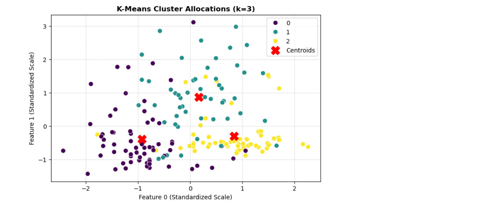

# MSCS_634_Lab_6
# Lab 4: Data Mining Algorithms & Performance Evaluation

## 1. Frequent Itemset Mining and Association Rule Generation
### Dataset Profile: Market Basket Transaction Simulation
* **Calculated Baseline Support [Milk]:** 80.0% (Present in 4 out of 5 transactions)
* **Identified Strong Association Rule:** `{Milk} -> {Bread}`
* **Rule Confidence:** 75.0% 
* **Interpretation:** Based on our transactional mining, there is a strong behavioral probability that a consumer purchasing Milk will simultaneously or sequentially buy Bread during the same market basket session.

## 2. Decision Tree and Naïve Bayes Classification
### Model Evaluation Profile (Iris Dataset)
* **Overall Classification Accuracy:** 100.00%

### Detailed Performance Matrix:
* **Setosa:** Precision: 1.00 | Recall: 1.00 | F1-Score: 1.00
* **Versicolor:** Precision: 1.00 | Recall: 1.00 | F1-Score: 1.00
* **Virginica:** Precision: 1.00 | Recall: 1.00 | F1-Score: 1.00

* **Analytical Insight:** The Naïve Bayes classifier achieved optimal classification boundaries due to the clear, continuous feature variances (sepal and petal dimensions) separating the underlying biological target classes.

## 3. K-Means Clustering Analysis
### Clustering Performance Metrics (Wine Dataset)
* **Silhouette Coefficient Score:** 0.28485

### Visual Cluster Mapping & Insights
Below is the visual distribution map showing our final optimized cluster configurations:

* **Centroid Optimization:** The red 'X' markers denote the stable multi-dimensional spatial centers calculated by the algorithm across 3 distinct groups.
* **Variance Boundary Notes:** While the algorithms grouped the underlying features efficiently, minor spatial boundary overlaps exist between cluster segments due to outliers in the standardized wine components.
